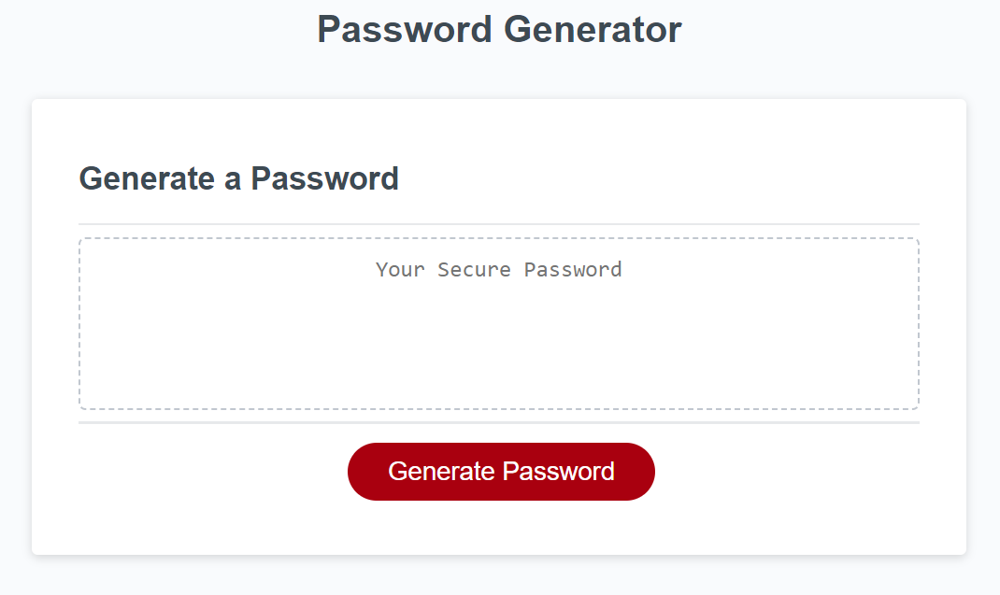

# password-generator
Password Generator  
  
[Password Generator Website](https://kevinchogan.github.io/password-generator/)

## Description

An application that an employee can use to generate a random password based on criteria they've selected.

## Installation

N/A

## Usage

* Click on "Generate Password".
* Choose the password length (between 8 and 128 characters).
* Choose whether or not to include lowercase letters.
* Choose whether or not to include uppercase letters.
* Choose whether or not to include numbers.
* Choose whether or not to include special characters (e.g. "#", "/", "%", etc.).  

After which, the password will appear on the web page.

## Credits

N/A

## License

Please refer to the LICENSE in the repo.

